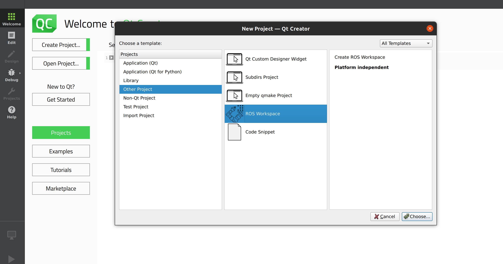
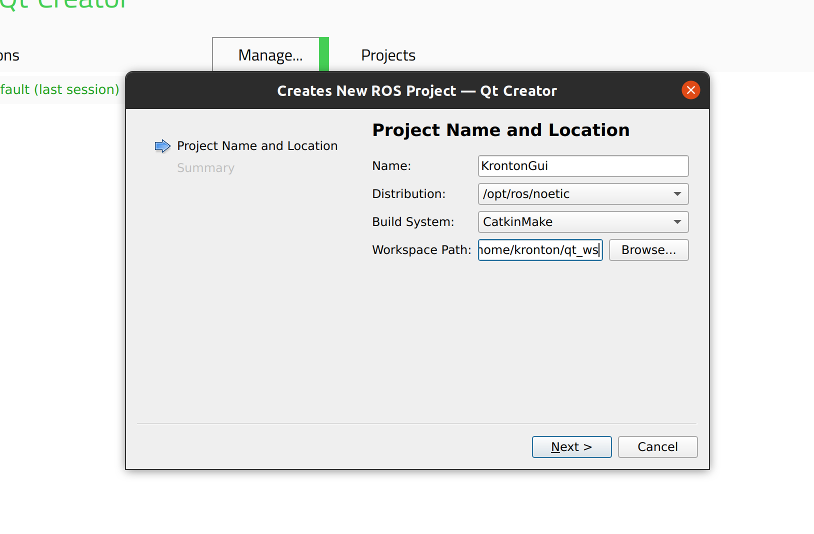

# ROS-GUI
template packages to create GUI for ROS applications using QT-creator in C++

## install ROS Qt Creator 

```
sudo snap install qtcreator-ros --classic
```
##  Qt ROS project

### create Qt-ROS project
1. open Qt-ROS application then ->  "create  project"
2. from "other project" -> "ROS Workspace"



### Configure ROS Workspace
After selecting "ROS Workspace," you need to configure the ROS workspace for your project.

3. Specify the project name.

4. Select the ROS distribution that you are using.

5. Choose or create a ROS workspace directory where your project will be stored.


6. Set the build system (usually 'CatkinMake' for ROS1 or 'colcon' for ROS2).


